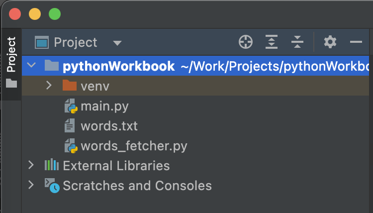

###### Практична робота №3
## Hanged wordle

### Мета роботи:
Попрактикуватись у роботі з рядками та списками у Python, закріпити знання з циклів.

## Завдання
У цій практичній вам пропонується реалізувати дві відомі текстові гри: Wordle та Hangman

### Wordle
Wordle - гра-хіт кінця 2021 року, де гравцеві пропонується вгадати слово з 6 спроб. Почитати точні правила та пограти можна [за посиланням](https://www.nytimes.com/games/wordle/index.html). Також існує [багато](https://wordle.global/uk) [локалізованих аналогів](https://kuryliak.pp.ua/doc/jsgames/words/index.html) [українською](https://wordle.global/uk)

##### Підготовка
Для того щоб почати, нам потрібно отримати перелік можливих слів. Ми поки ще не розглядали роботу з файлами, але встигли подивитись на підключення додаткових модулів, що нам зараз і знадобиться.

Створіть новий проект, скачайте та покладіть у папку проекту файл з [можливими словами](res/words.txt) та [python-скрипт](res/words_fetcher.py) для їх обробки.


Тепер ви можете імпортувати цей модуль та використати його для отримання переліку слів наступним чином:

```Python
import words_fetcher

words = words_fetcher.fetch_words(min_letters=3, max_letters=10)
print(words)
```
`min_letters` та `max_letters` - опціональні аргументи, що вказують допустимий диапазон розміру слів. Після виконання функції `fetch_words` результатом буде список слів

##### Вибір слова
Далі, нам потрібно обрати зі списку слів одне слово, яке буде загадано гравцю. Для цього нам знадобиться інший модуль - `random` та функція `randrange`, що дозволяє згенерувати випадкове число у заданому діапазоні. Якщо ми згенеруємо число від 0 до розміру списку, та використаємо його як індекс, то зможемо кожен раз отримувати інше слово. Використайте як зразок наступний код:
```Python
import random

word = words[random.randrange(0, len(words))]
```
Крім того, у модулі `random` саме для ситуації отримання випадкового елементу зі списку є зручний метод `choice`
```Python
word = random.choice(words)
```

##### Ігровий процес
1. Оберіть зі списку слів випадкове слово з 5 літер
2. Дайте користувачеві ввести слово-спробу. Якщо слово відсутнє у словнику, виведіть помилку та дайте спробувати знову
3. Якщо слово присутнє у словнику, виведіть це слово на екран, помітивши літери, що присутні у відповіді та стоять на своєму місці великим регістром, а літери, що є у відповіді але стоять не на своєму місці - зірочкою.  В цьому етапі вам допоможе операція перевірки наявності елемента в рядку чи множині `in`, а також метод `index` типу даних `string`, що знаходить індекс підрядочку всередині рядку.
```
> Enter a word: rover
> r o* v* e R # answer is VIGOR
```
4. Якщо користувач не вгадав з шести спроб, виведіть повідомлення про програш та правильну віповідь


### Hangman
Друга гра, яка пропонується до виконання у цій практичній це достатньо маловідома в нашій країні гра Hangman - ведучий загадує слово, після чого гравець намагається вгадати слово, називаючи літеру за літерою. За кожну неправильну літеру ведучий на листочку домальовує частину шибениці (тому і Hangman), восьма помилка приводить до програшу. Спробувати пограти можна [тут](https://hangmanwordgame.com/?fca=1&success=0#/) або [тут](https://thewordsearch.com/hangman/)

1. Аналогічно то попереднього завдання, оберіть випадкове слово-загадку, але в цей раз візміть довільне слово від 6 літер розміром.
2. Виведіть гравцеві кількість літер у слові, замінивши літери крапками (`......`)
3. Дайте користувачу ввести літеру, якщо вона є у слові - замініть відповідні крапки на літеру.
```
The word is ......
> a
The word is .a.a.a
```
4. Рахуйте кількість помилок та повідомте гравця про програш, коли їх стане вісім
```
The word is ......
> k
No such letter! 1/8 mistakes
The word is ......
> 
```

> Підказка. Для виконання цього завдання, можете створити список літер, які вже називав гравець. І перед виведенням поточного стану слова що відгадується продивитись його літера за літерою - якщо літера вже буле названа, то значить треба вивести її, якщо ні - то крапку

## Контрольні питання
- Що таке string slicing та як він працює?
- Де ми використовуємо оператор `in`?
- Що таке список та для чого він потрібен?
- Яким чином порівнюються рядочки? 

## Оцінювання

Максимальний бал - 5:
- 1.5 бали - реалізація гри Wordle;
- 1.5 бали - реалізація гри Hangman;
- 1 бал - виконання додаткового завдання на парі;
- 1 бал - відповідь на теоретичні питання при здачі;


## Матеріали для виконання
1. [Рядки у Python](https://hyperskill.org/knowledge-map/993)
2. [Списки](https://hyperskill.org/knowledge-map/1206).
