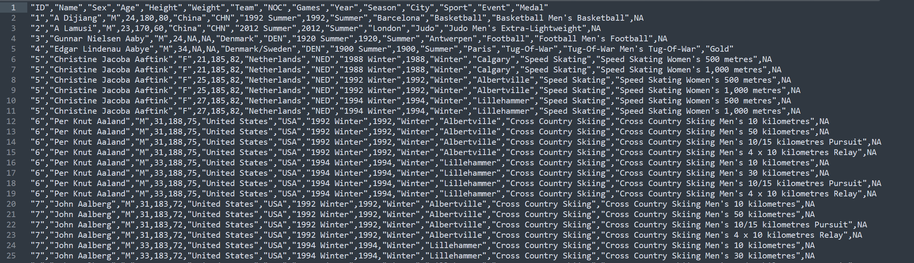

###### Практична робота №6
## Робота з текстовими даними

### Мета роботи:
На практиці спробувати використати Python для обробки текстових даних, навчитись працювати з файлами, використати нові структури даних (словники та множини) на практиці.

## Загальний опис

Це перша робота, яку ви викорнуєте не індивідуально, а в команді. Перед початком виконання прочитайте [правила виконання групових робіт](./group_rules.md)

В інтернеті існує достатньо багато джерел, де можна знайти підготовлені для аналізу набори даних ("датасети", datasets). В цій роботі ми будемо працювати зі справжньою базою даних [олімпійських атлетів за останні 120 років](https://www.kaggle.com/heesoo37/120-years-of-olympic-history-athletes-and-results) з сайту [Kaggle](https://www.kaggle.com/). Дані імпотровані в [гуглдок](https://docs.google.com/spreadsheets/d/1yuxIxtLh998CgoMA8d1ar7V-JCSpQAxepeZN5JJ5fxU/edit?usp=sharing).

`CSV` - це один з найпростіших форматів для даних. Його суть описана в назві - `CSV` - comma separated values - "значення, розділені комою". Фактично, ви можете відкрити такий файл будь-яким текстовим редактором та побачите напступне:



В першому рядку вказані назви стовбчиків, а в наступних - значення. Зауважу, що не дивлячись на назву у `.csv` можуть бути і інші розідльники, не тільки кома.

У наведеній табличці є проблема - в деякіх комірках є значення, що містять всередині кому, тому якщо ви просто зробите `split(',')`, то отримаєте некоректний результат. Але в цьому конкретному випадку вам достатньо качати дані з гуглдоку в форматі `.tsv` - те саме що і `.csv`, тільки замість коми - таб. Ви можете після цього спокійно робити `split('\t')` по символу таба. Не качайте дані напряму з Kaggle - вам доведеться робити ще додаткову роботу по вирізанню зайвих лапок.

## Завдання

Для початку, повторіть матеріал стосовно використання аргументів командного рядка [тут](https://www.digitalocean.com/community/tutorials/python-command-line-arguments) або [тут](https://machinelearningmastery.com/command-line-arguments-for-your-python-script/).

Ця практична складається з декількох завданнь. Їх слід виконувати **послідовно**, тобто найбільш повна програма матиме всередині себе всі завдання.

#### Завдання 1
Напишіть програму, що приймає наступні аргументи командного рядка:
1) Адреса файлу з даними;
2) Другим аргументом - завжди `-medals`
3) Країна. Назва може вводитись як за повною назвою (колонка `Team`), так і за кодом
4) Рік проведення Олімпіади
5) (Опціонально) `-output`
6) (Опціонально) файл для виведення результатів

Наприклад, `olympics.py data.csv -medals USA 1996`, або `olympics.py data.csv -medals AUT 1976 -output result.txt`

Програма має обробити наданий файл та вивести в стовбчик перші десять медалістів з цієї країни на заданій олімпіаді (у форматі "ім'я - дисципліна - тип медалі"), а під цим - сумарну кількість медалей за типом (золоті, срібні та бронзові) у цієї країни. Програма має коректно обробляти крайні випадки (у заданої країни менше 10 медалей, введена країна не існує або у введений рік не проводилась олімпіада). Якщо користувач ввів параметр `-output`, то результат має бути виведений не тільки на екран, а і у вказаний файл

#### Завдання 2
Додайте до програми підтримку іншої команди - `-total`, за якою аргументом йде рік. Наприклад, `olympics.py data.csv -total 1972`. Після цього програма має вивести на екран дані про всі країни, що здобули на цій олімпіаді хоча б одну медаль у форматі "країна - золото - срібло - бронза"

#### Завдання 3
Додайте до програми підтримку іншої команди - `-overall`, за яким йде довільна кількість країн. Наприклад, `olympics.py data.csv -overall Ukraine Ireland Canada`. Програма має вивести на екран для кожної з введених країн рік в якій вона здобула найбільшу кількість медалей та це число

#### Завдання 4
Додайте до програми команду `-interactive` після введеня якої програма переходить у інтерактивний режим (тобто зчитує у циклі команди через `input()`, як ви звикли). Користувач може вводити країну (за назвою або кодом), а програма має виводити статистику цієї країни - перша участь у олімпіаді (рік та місце проведення), найуспішніша олімпіада (за кількістю медалей, вивести це значення), найневдаліша, та середня кількість медалей кожного типу на кожній олімпіаді

#### Додаткове завдання на +1 бал
Розберіться та використайте модуль `argparse` для зручної роботи з аргументами командного рядка

## Як виконувати

1. Повторіть, якщо не пам'ятаєте, [string slicing](https://www.freecodecamp.org/news/python-substring-how-to-slice-a-string/), це може спростити життя в даній роботі
2. Згадаємо найпростіший варіант читання з файлу:
```Python
with open(path, 'r') as file:
    lines = file.readlines()
```
Нагадаю, що цей формат може бути повільним та не зручним для роботи з великими файлами. Наприклад, наш набір даних містить біля 300 тисяч рядків і 41Мб загалом (інші набори можуть містити сотні Мб або Гб), і зчитувати всі 40 мільйонів символів у масив перед початком роботи не раціонально. Замість цього, можна у циклі використовувати метод `file.readline()`, який буде повертати щоразу наступний рядок з файла, поки файл не закінчиться, після чого буде повернуто порожній рядок
```Python
next_line = file.readline()
while next_line:
    # do stuff with line
    next_line = file.readline()
```
3. В цій роботі, особливо на етапах починаючи з другого, вам може знадобитись словник (dictionary). Словник як структура даних зберігає множину пар "ключ-значення", коли за будь-яким ключем можна дістати віповідне значення. Приклад - телефонна книга.
```
phone_book = {
  "Ann": "095-150-23-34",
  "Bob": "063-456-12-43",
  "Charlie": "050-123-12-56"
}
```
Для того щоб дістати телефон Ann, достатньо викликати `phone_book["Ann"]`. Детальніше можна почитати [тут](https://www.w3schools.com/python/python_dictionaries.asp) або [тут](https://www.programiz.com/python-programming/dictionary). У цій роботі ви можете використовувати словник для того щоб, наприклад, накопичувати медалі по країнам (словник країна -> кількість медалей)

## Контрольні питання
1. Навіщо потрібні режими роботи з файлами `r`, `w`, `a`, `x`, `b`, `t`?
2. Навіщо потрібна конструкція `with ... as ...:`?
3. В чому різниця між списком, таплом, та множиною? Коли ми використовуємо ці структури даних?
4. Що таке аргументи командного рядка, для чого вони потрібні?
5. Що таке list comporehension та коли ми цим користуємось?

## Оцінювання

Максимальний бал - 6 (+1 додатковий):
- по одному балу за завдання 1-4;
- 1 бал - відповіді на питання при здачі;
- 1 бал - виконання практичного завдання при здачі.
- 1 додатковий бал за використання argparse
