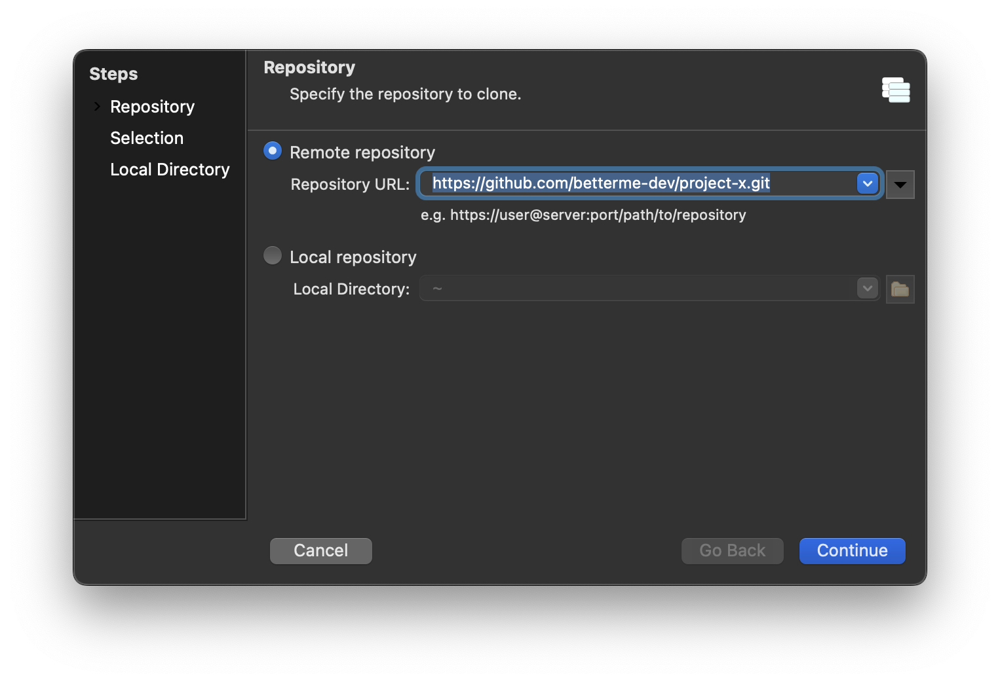
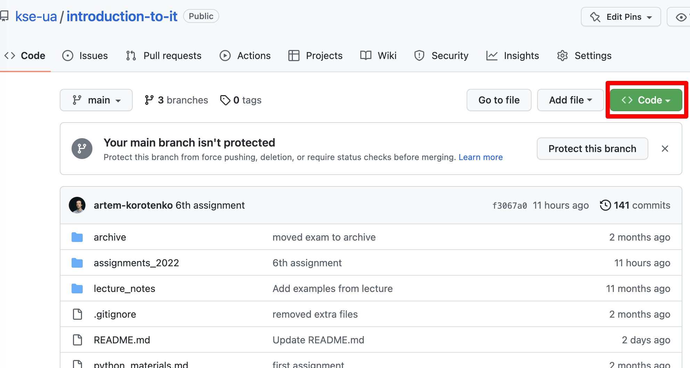
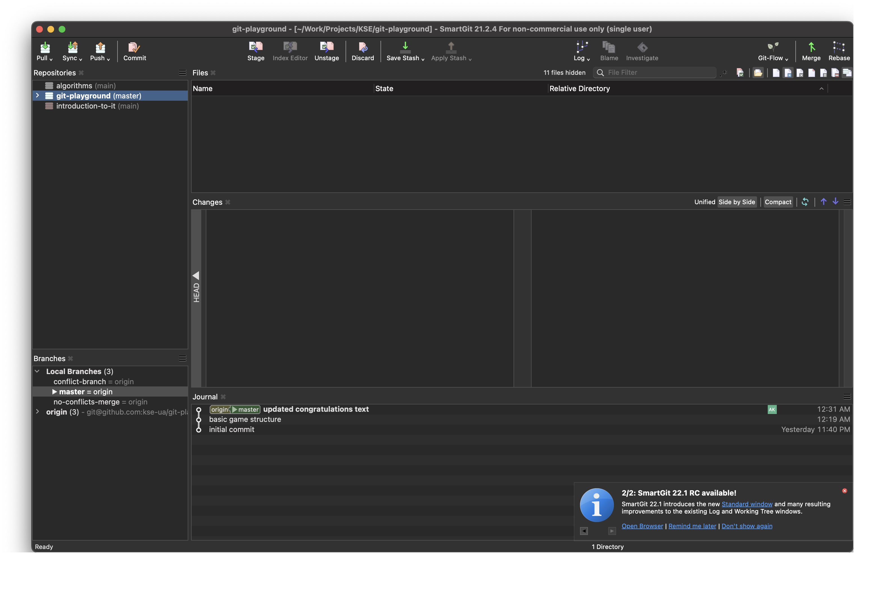
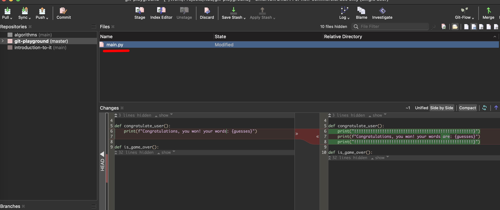
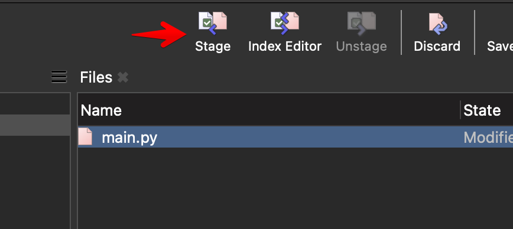
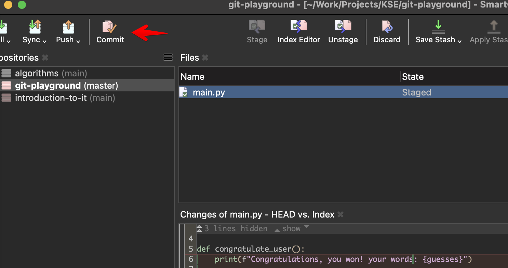
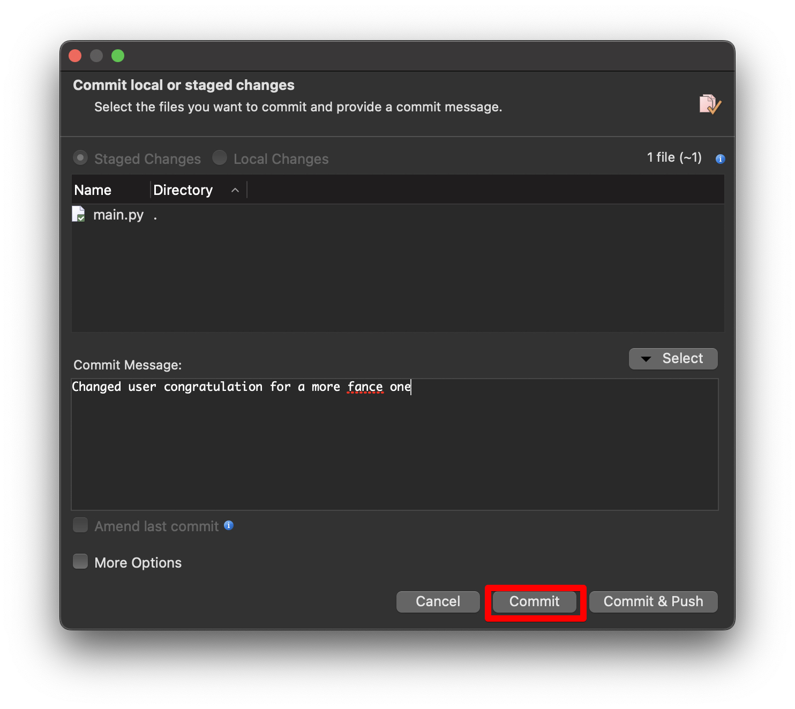
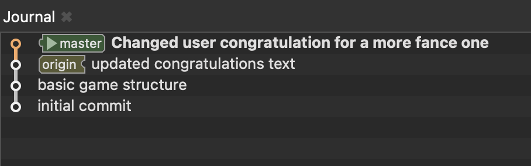
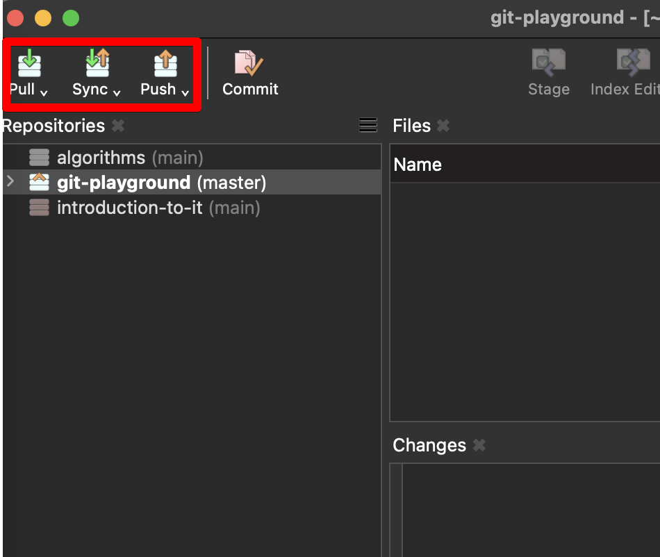

###### Допоміжний матеріал
## Робота з візуальним клієнтом Git

Після того як ви спробували попрацювати з git у консолі, ви можете використовувати у подальшому візуальні оболонки, що дозволяють працювати з репозиторіями у клієнті з GUI. Їх існує доволі багато - SourceTree, SmartGit, GitHub-клієнт, можна працювати напряму із PyCharm. Після того як ви розберетсь з одним клієнтом, ви можете спробувати інші та підібрати собі найбільш кофмортний саме для вас, або продвожити користуватиь консолллю. Цей документ описує роботу із клієнтом [SmartGit](https://www.syntevo.com/smartgit/), який є безкоштовним у навчальних цілях

### Клонування репозиторію

1. Для початку роботи, виберіть Repository > Clone
   
2. У вікні що зʼявилось, вставте адресу репозиторія, яку можна скопіювати на сайті. Зверніть увагу, що це не адреса веб-сторінки рпозиторію
   
3. В подальших крока вам потрібно обрати гілку, яку ви копіюєте та шлях на компʼютері, куди копіювати.
4. Якщо все зроблено правильно, ви маєте локальну копію репозиторію!
   

### Створення коммітів
1. Змініть якісь файл всередині репозиторію, або додайте новий. У вікні Files почтне відображатися змінений файл. Якщо ви виберете файл, то у вкладці Changes буде видно що саме змінилось у файлі порівняно з попередньою версію
   
2. Коли ви накопичите достатньо змін, для того щоб зробити комміт, для початку потрібно додати необхідні файли до staging area - це такий проміжний етап, коли ви помічаєте файли що хочете закомітити (це те що в консолі робиться через `git add`). Виберіть необхідні файли, та натисніть Stage. Значки файлів після цього зміняться
   
3. Тепер ви можете робити комміт! Зробіть змістовний опис комміту та натисніть Commit
   
   
4. Тепер ви зможете побачити свій комміт у вкладці Journal, але позначка origin лишиться на старому комміті - тому що поки що наш комміт зроблений тільки локально, і не залитий на сервер.
   
5. Для того щоб залити комміт у віддалений репозиторій, потрібно спочатку зробити Pull, підтянувши собі актуальні зміни в віддалоеному репозиторії (якщо хтось встиг туди щось залити, поки ви працювали, ваш локальний репозиторій оновиться. Саме на цьому етапі можут виникнути конфлікти), а потім Push, залвиши свій комміт
   

### Робота з гілками
WIP